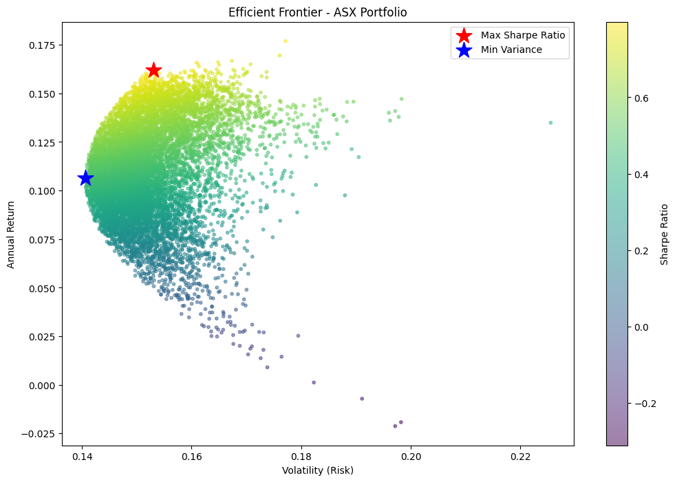

# Markowitz LLM Project

A personal project exploring portfolio optimization using Modern Portfolio Theory (Markowitz), applied to ASX stocks, with a local Large Language Model (LLM) that explains the results in plain language.

This project is still a work in progress.

## About

The idea behind Modern Portfolio Theory is simple: for any level of risk, there is a mix of investments that gives the best possible return. This project uses a Monte Carlo simulation to test thousands of random portfolio combinations and find that mix, then builds what is called an "efficient frontier" from the results. It also finds the best portfolios directly with optimizers (scipy and cvxpy) and compares the two approaches.

On top of this, a local LLM (run with Ollama) explains the results in plain language, so they aren't just shown as raw numbers. The LLM only explains numbers the optimizer has already calculated, and any number in its answer that doesn't match the results is flagged.

## What it does right now

- Downloads daily price data for a set of ASX stocks (currently CBA, BHP, CSL, WES, and MQG) using Yahoo Finance
- Calculates daily returns, average returns, and the covariance between stocks
- Runs a Monte Carlo simulation of 10,000 random portfolios
- Calculates return, risk (volatility), and Sharpe ratio for each portfolio
- Plots the efficient frontier
- Identifies two key portfolios:
  - The portfolio with the highest Sharpe ratio (best risk-adjusted return)
  - The portfolio with the lowest risk (minimum variance)
- Finds the same two portfolios directly with optimizers (scipy's SLSQP for the highest Sharpe ratio, cvxpy for minimum variance) and compares the Sharpe ratio and speed with the Monte Carlo search
- Explains the results in plain English with a local LLM (Ollama), and flags any number in the explanation that doesn't match the results
- Serves the optimizers and explanations through a FastAPI app (`POST /optimize` and `POST /explain`) with API key authentication, rate limiting and input validation
- Runs security scans (Bandit, pip-audit) and the tests automatically with GitHub Actions

## Results



Each dot is one randomly weighted portfolio of the five stocks, shaded by its Sharpe ratio (yellow is higher). The red star is the portfolio with the highest Sharpe ratio and the blue star is the one with the lowest risk. The notebook prints the return, volatility, Sharpe ratio and stock weights for both.

The results use daily prices from January 2021 to December 2025 and assume a 4% risk-free rate.

## Tech stack

- Python
- pandas, numpy
- yfinance (market data)
- matplotlib (charts)
- scipy, cvxpy (optimization)
- Ollama (local LLM), httpx
- FastAPI, slowapi (API and rate limiting)
- pytest, Bandit, pip-audit, GitHub Actions (tests and security checks)
- Jupyter

## Getting started

You need Python 3.11 or newer and an internet connection (prices are downloaded from Yahoo Finance).

```bash
git clone https://github.com/khalisha-hf/markowitz-llm.git
cd markowitz-llm
python -m venv venv
source venv/bin/activate        # Windows: venv\Scripts\activate
pip install -r requirements.txt
```

### Notebook

```bash
pip install jupyter
jupyter notebook notebooks/01_eda.ipynb
```

Then run all the cells (or open the notebook in VS Code and pick the `venv` kernel). The last cell saves the chart to `images/efficient_frontier.png`.

### Compare Monte Carlo with the optimizers

```bash
python run_comparison.py
```

### Plain-English explanation (local LLM)

Install Ollama from [ollama.com](https://ollama.com), then download a model and run the script:

```bash
ollama pull llama3.2
python explain_portfolio.py
```

To use a different model or Ollama address, set `OLLAMA_MODEL` or `OLLAMA_URL` in your `.env` file (defaults: `llama3.2` and `http://localhost:11434`). Larger models such as `llama3.1` follow the instructions more reliably but are slower.

### API

Create a `.env` file in the project folder with a key of your choice (`.env` is in `.gitignore`, so it won't be committed):

```
OPTIMIZER_API_KEY=choose-a-secret-key
```

Start the server:

```bash
uvicorn api:app --reload
```

Then send a request, or try it in the browser at http://127.0.0.1:8000/docs:

```bash
curl -X POST http://127.0.0.1:8000/optimize \
  -H "X-API-Key: choose-a-secret-key" \
  -H "Content-Type: application/json" \
  -d '{"tickers": ["CBA.AX", "BHP.AX", "CSL.AX"], "start": "2021-01-01", "end": "2025-12-31"}'
```

Send the same request to `/explain` to also get a plain-English explanation (Ollama needs to be running). The response lists any numbers in the explanation that don't match the results under `unsupported_numbers`.

### Tests

```bash
python -m pytest tests/ -v
```

## Project structure

```
notebooks/
  01_eda.ipynb              # Exploratory data analysis and Monte Carlo simulation
src/
  data.py                   # Downloads prices and calculates returns
  optimizer.py              # Monte Carlo search and direct optimizers
  explain.py                # Plain-English explanations from a local LLM
tests/
  conftest.py               # Test setup: API client with fake price data
  test_security.py          # API tests: API key, input validation, rate limiting
  test_optimizer.py         # Optimizer tests: weights, labels, reproducibility
  test_explain.py           # LLM tests with a fake model: prompt, number checks, /explain
images/
  efficient_frontier.png    # Chart shown above (created by the notebook)
.github/workflows/
  security.yml              # Runs Bandit, pip-audit and the tests on GitHub
api.py                      # FastAPI app for the optimizers
run_comparison.py           # Compares Monte Carlo with the optimizers
explain_portfolio.py        # Prints a plain-English explanation of the results
conftest.py                 # Lets pytest import from the project root
requirements.txt            # Python packages the project needs
```

## Limitations

- The portfolios are chosen and scored on the same 2021–2025 prices, so they look better than they would on new data.
- The LLM can still make mistakes. The number check flags numbers that aren't in the results, but not real numbers attached to the wrong portfolio or wrong statements with no numbers in them. Small local models like `llama3.2` make these mistakes more often than larger ones, so the prompt gives the model company names, sorted weights and pre-calculated figures instead of asking it to work them out.

## Next steps

- Test the portfolios on data they weren't built from (backtest)
- Add more stocks or let the stock list be configurable
- Clean up the notebook into reusable functions/scripts

## Status

Work in progress. Built as a personal learning project.
